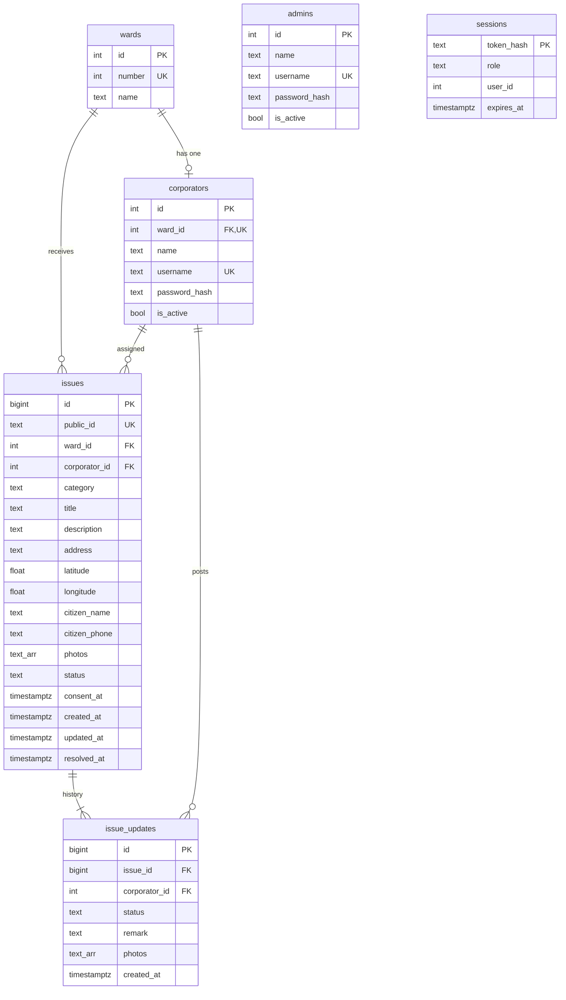

# WardWatch architecture

## 1. Database schema

Source of truth: [`server/db/migrations/`](../server/db/migrations). The five required tables plus one
small `sessions` table (server-side login sessions, used instead of JWTs).



| Table | Notes |
| --- | --- |
| `wards` | `number` is the human-facing ward number (unique). |
| `corporators` | **One per ward** (`ward_id` is UNIQUE). Username unique case-insensitively (`lower(username)` index). `is_active=false` blocks login and kills sessions; rows are never deleted so history stays attributed. |
| `admins` | Mayor / admin accounts, same shape as corporators minus the ward. |
| `issues` | `public_id` is the citizen-facing ID (`WW-` + 8 random chars from an alphabet without look-alikes). `corporator_id` is copied from the ward's active corporator at submission (NULL if none). `status` ∈ `submitted · acknowledged · in_progress · resolved · rejected`. `category` ∈ `roads · water · sanitation · streetlights · drainage · parks · other`. `resolved_at` is set when status becomes `resolved`, cleared if reopened. `photos` are the citizen's uploads (URL paths). `latitude`/`longitude` (WGS84, 6 decimals) are set from the map picker; nullable only for issues filed before migration 003, both-or-neither and range-checked by `CHECK`s. `citizen_phone` is the normalised 10-digit Indian mobile. `consent_at` is when the citizen ticked the declaration (NULL only for issues filed before migration 004). |
| `issue_updates` | Append-only history. `status` is the issue status **after** the update, so the timeline can be rendered without diffing. Row #1 is written on submission (`corporator_id` NULL = citizen). Corporator rows can carry a remark and/or photos, with or without a status change. |
| `sessions` | Opaque cookie token → only its SHA-256 is stored. Expired rows are purged hourly. |

Constraints worth knowing: status/category/length `CHECK`s live in the database, so bad data cannot get
in even from a script. Indexes cover the hot paths: `(corporator_id, status)` for the corporator inbox,
`(ward_id, status)` for ward stats, `issue_updates(issue_id, created_at)` for history.

**Dashboard definitions** (`server/src/services/stats.js`): *open* = submitted + acknowledged +
in progress · *resolution rate* = resolved ÷ (total − rejected) · *overdue* = open and older than
`OVERDUE_DAYS` (default 7) · *avg. resolution* = mean hours from filing to resolution over resolved issues.

## 2. API

All JSON under `/api`. Errors always look like
`{ "error": { "code": "validation_error", "message": "...", "fields": { "phone": "..." } } }`.
`multipart/form-data` is used wherever photos are uploaded (field name `photos`, max 5 × 5 MB, JPEG/PNG/WebP).

### Public (no login)

| Method & path | Body / query | Response |
| --- | --- | --- |
| `GET /api/health` | - | `{ status: "ok" }` (touches the DB) |
| `GET /api/wards` | - | `{ wards: [{ id, number, name }] }` |
| `POST /api/issues` | multipart: `ward_id, category, title, description, address?, latitude, longitude, name, phone, consent, photos[]` - required: all except `address` and `photos`. `phone` = 10-digit Indian mobile (6-9 start; `+91`/`91`/`0` prefix and spaces tolerated). `consent` must be `true`. `latitude`/`longitude` in -90..90 / -180..180 | `201 { issue_id, created_at }` · rate-limited |
| `GET /api/issues/:publicId` | ID is normalised (case / missing dash tolerated) | `{ issue: { public_id, title, description, category, address, status, ward, photos, created_at, updated_at, resolved_at, updates: [{ status, remark, photos, by, created_at }] } }` - **no name/phone** · `404` if unknown |

### Auth (session cookie `ww_session`)

| Method & path | Body | Response |
| --- | --- | --- |
| `POST /api/auth/login` | `{ username, password }` | `{ auth: { role: "corporator"\|"admin", user: { id, name, username, ward? } } }` + cookie · `401` generic error. One endpoint for both roles: the role is whichever table holds the account (if a username exists in both, the password decides). |
| `GET /api/auth/me` | - | `{ auth: {...} }` or `{ auth: null }` |
| `POST /api/auth/logout` | - | `204`, cookie cleared |

### Corporator (`403` for other roles, `401` if signed out)

| Method & path | Body / query | Response |
| --- | --- | --- |
| `GET /api/corporator/issues` | `?status=open\|submitted\|acknowledged\|in_progress\|resolved\|rejected&page=1` | `{ issues[], total, page, page_size, counts: { <status>: n } }` - own issues only, open first |
| `GET /api/corporator/issues/:publicId` | - | `{ issue }` incl. `citizen: { name, phone }` and `location: { latitude, longitude } \| null`; `404` if not theirs |
| `POST /api/corporator/issues/:publicId/updates` | multipart: `status?, remark?, photos[]` | `201 { issue }` (updated). Needs a status change, remark or photo; `resolved`/`rejected` require a remark |

### Admin (`403` for other roles)

| Method & path | Response |
| --- | --- |
| `GET /api/admin/dashboard` | `{ totals, wards[], corporators[], overdue_days, generated_at }` - each block has `total, submitted, acknowledged, in_progress, resolved, rejected, open, overdue, avg_resolution_hours, resolution_rate` |

Static: `GET /uploads/<uuid>.<ext>` serves stored photos. In production every other non-API `GET`
falls back to the React app's `index.html`.

## 3. Frontend

### Routes / pages

| Route | Page | Access |
| --- | --- | --- |
| `/` | `Home` | public |
| `/report` | `ReportIssue` | public |
| `/submitted/:id` | `IssueSubmitted` (shows/copies the Issue ID) | public |
| `/track`, `/track/:id` | `TrackIssue` | public |
| `/login` | `Login` (shared by corporators and admins; `/corporator/login`, `/admin/login` redirect here) | public |
| `/corporator` | `CorporatorIssues` (tabs: open / resolved / rejected / all, paged) | corporator |
| `/corporator/issues/:id` | `CorporatorIssueDetail` (details, update form, history) | corporator |
| `/admin` | `AdminDashboard` | admin |
| `*` | `NotFound` | - |

`ProtectedRoute` sends signed-out visitors to `/login` (and back afterwards), and signed-in users of the other role to their own home.

### Component hierarchy

```
main.jsx
└─ BrowserRouter
   └─ AuthProvider                       (context: auth, login, logout)
      └─ App                             (route table)
         └─ Layout
            ├─ Header                    (nav, sign out)
            ├─ <Outlet />
            │   ├─ Home
            │   ├─ ReportIssue
            │   │   ├─ Alert
            │   │   ├─ FormField ×N        (required * marker)
            │   │   ├─ CheckboxField       (consent declaration)
            │   │   ├─ LocationPicker      (lazy-loaded; Leaflet + OSM tiles, GPS button)
            │   │   └─ PhotoUploader
            │   ├─ IssueSubmitted
            │   ├─ TrackIssue
            │   │   ├─ Spinner / Alert
            │   │   ├─ IssueDetails
            │   │   │   ├─ StatusBadge
            │   │   │   └─ PhotoGallery
            │   │   └─ IssueTimeline
            │   │       └─ PhotoGallery
            │   ├─ Login                 (Alert, FormField, show/hide password)
            │   ├─ ProtectedRoute role="corporator"
            │   │   ├─ CorporatorIssues  (Alert, Spinner, StatusBadge)
            │   │   └─ CorporatorIssueDetail
            │   │       ├─ IssueDetails  (+ citizen contact)
            │   │       ├─ UpdateForm    (Alert, FormField, PhotoUploader)
            │   │       └─ IssueTimeline
            │   ├─ ProtectedRoute role="admin"
            │   │   └─ AdminDashboard    (StatCard ×5, WardBar per ward, performance table)
            │   └─ NotFound
            └─ Footer
```

### Frontend conventions

- `api/client.js` is the only place that calls `fetch`; it throws `ApiError { status, message, fields }`
  so forms can show per-field server validation messages next to the inputs.
- Statuses and categories are defined once per side (`client/src/lib/constants.js`,
  `server/src/lib/constants.js`); the database `CHECK` constraints are the third copy - change all three.
- Tailwind v4, utility classes plus a handful of shared component classes in `index.css`
  (`.card`, `.btn`, `.input`, `.label`). No UI library, no chart library (the ward breakdown is a CSS
  stacked bar with an `aria-label` per row).

### LocationPicker

`components/LocationPicker.jsx` is a controlled component (`latitude`, `longitude`, `onChange`, `error`,
`disabled`); the form owns the state. Leaflet is created once in an effect and driven through refs, with a
second effect syncing the marker to props. The Leaflet container is a **separate inner `<div>` with a
constant `className`**: Leaflet adds its own classes to that element, and React would strip them if it
re-rendered a changing `className` on it (the error border lives on the outer wrapper instead).
The component is `React.lazy`-loaded so Leaflet (~51 KB gzipped) is only downloaded on the report page.

## 4. Key flows

**Submitting an issue** - `POST /api/issues` → rate limit → multer buffers files in memory →
zod validates fields → files checked by magic bytes and written under random names → one transaction
looks up the ward's corporator, inserts the issue (retrying on the ~impossible ID collision), and inserts
the first `issue_updates` row → returns the ID. If the DB write fails the saved files are deleted.

**Corporator update** - one transaction: `SELECT … FOR UPDATE` on the issue (scoped to the corporator's
own id, so other wards' issues 404), insert the `issue_updates` row, update `issues.status / updated_at /
resolved_at`. Concurrent updates serialise on the row lock.

**Authentication** - `POST /api/auth/login` looks the username up in `admins` and `corporators`, verifies bcrypt, inserts a `sessions` row, sets the cookie. `loadSession`
middleware hashes the cookie and looks it up on every `/api` request; `requireRole` guards routes.
